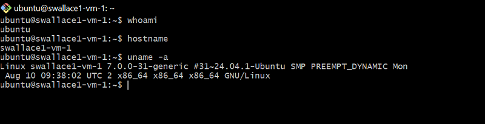

# Week 3 - Virtual Machines on Cloud Platforms

## W3.1 - Jetstream2 Virtual Machine

An Ubuntu virtual machine was created on Jetstream2 using the OpenStack command-line interface from Git Bash on Windows.

### Configuration

| Item | Value |
| --- | --- |
| Platform | Jetstream2 |
| Image | Featured-Minimal-Ubuntu24 |
| Flavor | m3.tiny |
| vCPUs | 1 |
| RAM | 3072 MB |
| Disk | 20 GB |
| VM name | swallace1-vm-1 |
| SSH key | swallace1 |
| Security group | remotelogin |
| Login user | ubuntu |

The existing ED25519 SSH key was first verified through GitHub. The public key was then imported into Jetstream Horizon, and an application credential was created for command-line access.

The OpenStack client was installed in a Python virtual environment on the Windows host. The downloaded `clouds.yaml` credential file was stored under `~/.config/openstack/`, and the OpenStack CLI was used to verify access to Jetstream resources.

The VM was created using the Ubuntu 24.04 minimal image and the smallest available flavor suitable for the exercise. The `remotelogin` security group was used to permit remote SSH access.

After the VM became active, a floating IP address was allocated and SSH access was established successfully.

### Verification

Inside the remote VM, the following commands were executed:

```bash
whoami
hostname
uname -a
```
The output confirmed that the login user was `ubuntu`, the hostname was `swallace1-vm-1`, and the system was running Ubuntu 24.04 Linux.

### Proof of Successful Login



### Resource Cleanup

After successful verification and documentation, the Jetstream2 virtual machine was deleted and the temporary floating IP address was released. This ensured that cloud resources were not left allocated after completion of the exercise.